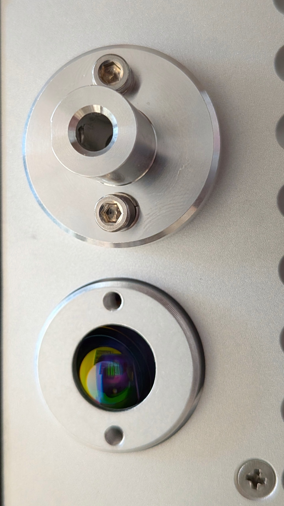

ArduMM Controllers for Lab 203
===================================

[Arduino](https://micro-manager.org/Arduino) device adatper for Micromanager.

# PhotonMaker
[Manual](https://www.nanotoolsbio.com/_files/ugd/c3bee4_bcea98b0b7ba4d2aa8f413fe1c6c36ac.pdf)

[DB15 color code](https://cdn.graftek.com/system/files/14147/original/785605-01.pdf)

### TTL trigger IN

## PhotonMaker setup

PhotonMaker control with 3 ArduMM pins and  8-channel multiplexer ([74HC4051D](https://arduino.ua/prod6234-modyl-analogovogo-myltipleksora-74hc4051d?srsltid=AfmBOopynwxA2QRn2_hYkh429Qz9YPAdudDBhhF_F8vhxPwqT6g5fnpo)).

### ArduMM digital IO

| PIN  | Bit  | Decimal Value ON | Use  |
| :--: | :--: | :--------------: | :--: |
|  8   |  0   |        1         | N/A  |
|  9   |  1   |        2         | BNC  |
|  10  |  2   |        4         | BNC  |
|  11  |  3   |        8         | S2   |
|  12  |  4   |        16        | S1   |
|  13  |  5   |        32        | S0   |

### System config

| IN S0 | IN S1 | IN S2 | ArduMM Switch-State | Channel ON | PhotonMaker Channel | PhotonMaker DB15 PIN |
| :---: | :---: | :---: | :-----------------: | :--------: | :-----------------: | :------------------: |
|   L   |   L   |   L   |          0          |     Y0     |          -          |          -           |
|   H   |   L   |   L   |         32          |     Y1     |     UV (398 nm)     |          7           |
|   L   |   H   |   L   |         16          |     Y2     |    Blue (452 nm)    |          3           |
|   H   |   H   |   L   |         48          |     Y3     |    Cyan (500 nm)    |          6           |
|   L   |   L   |   H   |          8          |     Y4     |   Green (515 nm)    |          2           |
|   H   |   L   |   H   |         40          |     Y5     |   Amber (601 nm)    |          4           |
|   L   |   H   |   H   |         24          |     Y6     |    Red (638 nm)     |          1           |
|   H   |   H   |   H   |         56          |     Y7     |        White        |          5           |

_Note: Y0 stay unused because it is HIGH when all arduino pins are LOW._

# Lynx

Lumencor Lynx - 4 colour OEM modification of the Lumencor Aura II.

### Light path

Top filter - 390-475-632 (11-1083)
Bottom filter - 542/33-25

### Wavelength
|Ch. name| Filter max | Ch. num | Lynx DB15 IN |
|:-:|:-:|:-:|:-:|
|Violet (405 nm)|390 nm|1|12|
|Cyan (488 nm)  |475 nm|2|3|
|Green (540 nm) |542 nm|3|2|
|Red (640 nm)   |632 nm|4|15|

_Note: it's estimated channels wavelength, exact filters parameters are unknown._

### TTL trigger IN

_Note: Lynx's DB15M pin-out is the same with Lumencor Aura II_

## Lynx setup

### System config

| Arduino PIN | Bit  | Decimal Value ON | Use    | Lynx DB15 PIN |
| :--: | :--: | :--------------: | :----: | :-----: |
|  8   |  0   |        1         | Violet ||
|  9   |  1   |        2         | Cyan   ||
|  10  |  2   |        4         | Green  ||
|  11  |  3   |        8         | Red    ||
|  12  |  4   |        16        | BNC    ||
|  13  |  5   |        32        | BNC    ||

### Liquid light guide coupling

Coupling with proprietary liquid light guide Olympus U-LLG150.

|Original LLG port| LLG port model|
|:-:|:-:|
|||